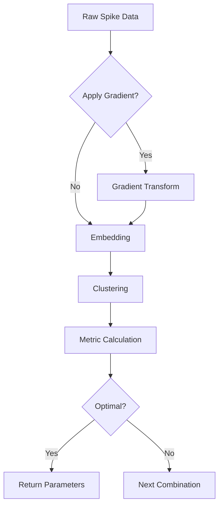

```markdown
# 🧠⚡ Automated Spike Sorting Optimization


*Example workflow diagram (replace with actual image)*

A **color-coded optimization pipeline** for spike sorting with interactive parameter selection and cluster quality visualization.

## 🚀 Features

| Feature              | Description                                                                 | Visualization Example        |
|----------------------|-----------------------------------------------------------------------------|-------------------------------|
| Gradient Processing  | `apply_gradient(data, n=2)`<br>Enhances spike features through differentiation |  |
| Dimensionality Reduction | UMAP/Spectral Embedding<br>`n_components=2-3`                                |  |
| Clustering           | Agglomerative (Ward/Average/Complete)<br>`n_clusters=2-10`                  |  |

## 🛠️ Installation

```bash
# Color-coded installation guide
pip install \
  numpy \           # ➡️ Array processing (v1.23+)
  scikit-learn \    # ➡️ Clustering & metrics (v1.2+)
  umap-learn        # ➡️ Non-linear embedding (v0.5+)
```

## 📈 Workflow Overview



## 🎛️ Parameter Configuration Guide

### 1️⃣ Gradient Settings
```python
# Recommended for 3000+ spikes 🚀
gradient_range = range(0, 3)  # 0=Raw, 1=1st deriv, 2=2nd deriv
```

### 2️⃣ UMAP Parameters
```python
{
  'n_neighbors': 15,       # 👥 Local vs global balance
  'min_dist': 0.1,         # 📏 Cluster compactness
  'n_components': 2        # 🎨 2D vs 3D visualization
}
```

### 3️⃣ Clustering Options
```python
AgglomerativeClustering(
  n_clusters=5,            # 🔢 Start with sqrt(n_spikes)
  linkage='ward'           # ⛓️ Ward=var, Complete=max
)
```

## 📊 Evaluation Metrics Comparison

| Metric            | Best For                  | Ideal Range | Color Code      |
|-------------------|---------------------------|-------------|-----------------|
| Silhouette Score  | Balanced cluster density  | 0.6-1.0     | 🟢 High is good |
| Davies-Bouldin    | Separated cluster centers | 0-0.5       | 🔵 Low is good  |
| Calinski-Harabasz | Large datasets            | 300+        | 🟡 Higher=better|

## 💻 Example Run (Color Output)

```python
# Input parameters
>>> Enter total number of spikes: 3364
>>> Suggested gradient range: 0-3 🌈
>>> Choose embedding method: UMAP 🗺️
>>> Select metric: silhouette 📐

# Optimization progress
Processing combination 23/150...
✅ Found new best: Silhouette=0.72
┌──────────────────────┬──────────────┐
│ Gradient Order       │ 2            │
│ UMAP n_neighbors     │ 25           │
│ Clusters             │ 6            │
└──────────────────────┴──────────────┘
```

## 📝 Best Practices

1. **Parameter Ranges**:
   - 🔄 Start broad then narrow down
   - 📈 Use logarithmic scales for large ranges

2. **Visual Checks**:
   ```python
   import matplotlib.pyplot as plt
   plt.scatter(embedded[:,0], embedded[:,1], c=labels, cmap='tab20')
   plt.title(f'Cluster Separation (Score: {best_score:.2f})')
   plt.show()
   ```

## 🚨 Common Errors

| Error Type           | Solution                  | Color Code |
|----------------------|---------------------------|------------|
| Memory Error         | Reduce gradient order     | 🟠 Warning |
| Cluster Collapse     | Increase min_dist         | 🔴 Critical|
| Metric Contradiction | Try different evaluation  | 🟡 Caution |

## 🌐 References

- [UMAP Documentation](https://umap-learn.readthedocs.io) 📘
- [Scikit-learn Clustering](https://scikit-learn.org/stable/modules/clustering.html) 📗
